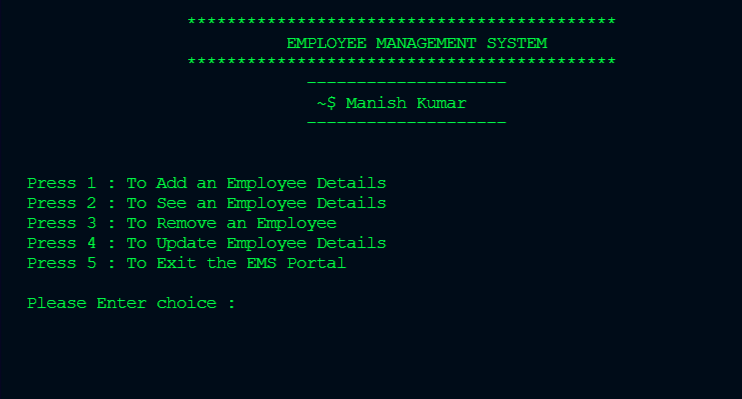

# Employee-Management-System

A Java-based Text User Interface (TUI) application for managing employee records. The system supports adding, removing, updating, and viewing employee details, utilizing Object-Oriented Programming (OOP) principles for modular and maintainable code.



## Table of Contents
- [Features](#features)
- [Installation](#installation)
- [Usage](#usage)
- [Code Structure](#code-structure)
- [Contributing](#contributing)
- [License](#license)

## Features
- **Add Employee**: Allows you to add new employees to the system by providing details such as name, ID, department, and position.
- **Remove Employee**: Enables you to remove an employee from the system using their unique employee ID.
- **Update Employee**: Facilitates updating the details of an existing employee.
- **View Employee**: Lets you view the details of all employees or a specific employee using their ID.

## Installation
To set up the Employee Management System on your local machine, follow these steps:

1. **Clone the repository**:
   ```sh
   git clone https://github.com/manishkmr29/Employee-Management-System.git

2. Navigate to the project directory:
   ```sh
     cd Employee-Management-System

## Usage
To compile and run the program, ensure you have Java installed on your system.

1. Compile the program:
 
        javac EmployManagementSystem.java

2. Run the program:
 
        java EmployManagementSystem

## Code Structure
  The code is organized to ensure clarity and separation of concerns. Here is an overview of the main classes:

  EmployManagementSystem.java: The main class that contains the TUI and handles user inputs for various operations.
  EmployDetail.java: A class representing an employee, including attributes such as ID, name, department, and position.
  Employee_Add.java: A class responsible for adding new employee records.
  Employee_Show.java: A class responsible for viewing employee records.
  Employee_Remove.java: A class responsible for removing employee records.
  Employee_Update.java: A class responsible for updating existing employee records.
  MainMenu.java: A class that displays the main menu and handles menu navigation.
  CodeExit.java: A class that handles exiting the application.
